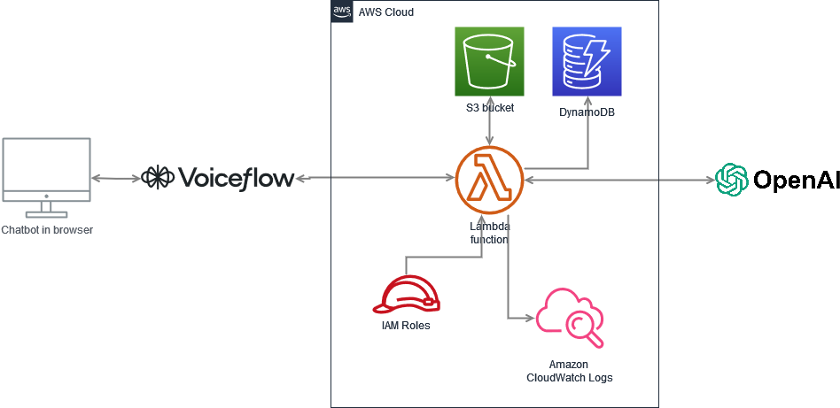

# ChatGPT-Powered Chatbot for Websites

This repository contains the code and resources needed to implement a ChatGPT-powered chatbot on your website. The chatbot is trained on your specific knowledge base materials, hosted on AWS, and uses **OpenAI's GPT-4** model to handle queries. The frontend is built using **Voiceflow**, which provides an easy-to-use interface for integrating and managing AI workflows.

## Features
- **AI Chatbot**: Powered by GPT-4, capable of answering queries based on a custom knowledge base.
- **AWS Integration**: Backend deployed using AWS Lambda and DynamoDB for a scalable, serverless architecture.
- **Voiceflow Frontend**: A no-code solution for building and deploying interactive chatbot interfaces.
- **Knowledge Base Storage**: Data stored in Amazon S3, with Retrieval-Augmented Generation (RAG) for efficient context-based responses.

## Prerequisites
- OpenAI API key with GPT-4 access (approx. $5 in credit needed for API calls).
- AWS account for Lambda, S3, and DynamoDB.
- Voiceflow account to build and deploy the chatbot frontend.

## Setup Guide
1. **Prepare Documents**: Store your knowledge base (e.g., your CV or other data) and AI instructions in S3 buckets.
2. **Deploy Backend**: Use AWS Lambda to handle chat requests and store history in DynamoDB. Set environment variables for bucket name, DynamoDB table, region, and OpenAI API key.
3. **Configure Frontend**: Import the provided Voiceflow template and connect it to the Lambda Function URL for handling GET and POST requests.
4. **Publish and Embed**: Customize the chatbot interface in Voiceflow, and embed the widget on your website by adding the provided script to your `index.html`.

For full implementation instructions, check out the [Medium article](https://medium.com/@andris.keish/how-to-add-a-chatgpt-powered-chatbot-to-your-website-95f910089461).

## Potential Improvements
- Explore [LLTR](https://github.com/awslabs/llrt) for faster query processing.
- Voiceflow currently lacks direct image recognition support, which may require custom solutions.

## Credits
This project was inspired by Bo Star's tutorial, which you can find [here](https://www.youtube.com/watch?v=sWbqPKkI44g).